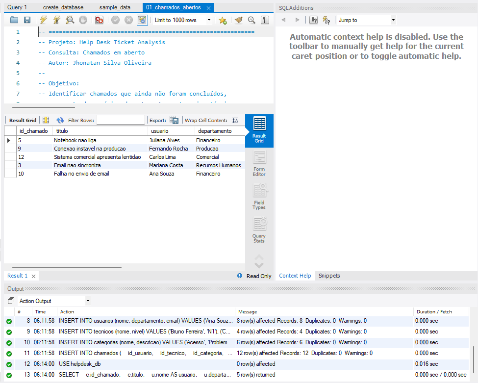
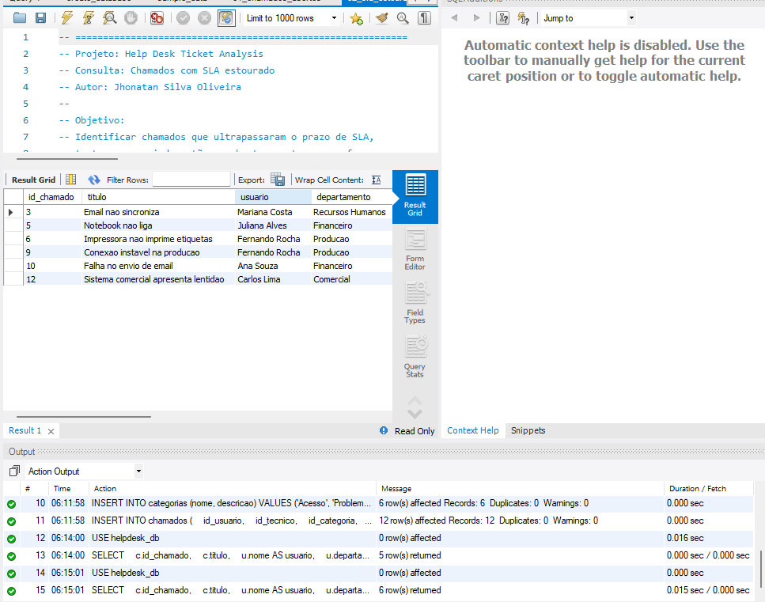
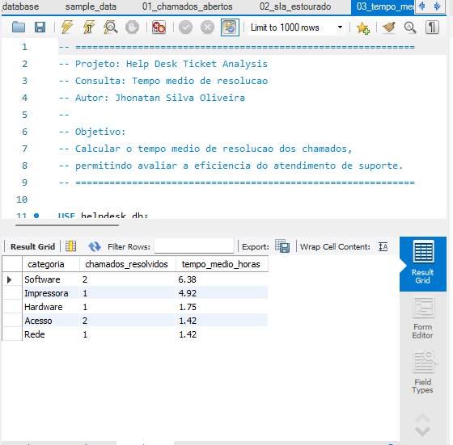
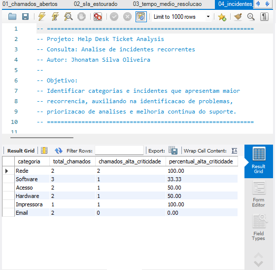
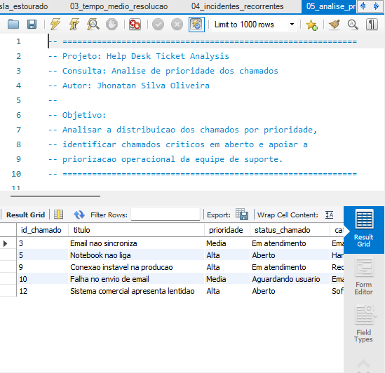
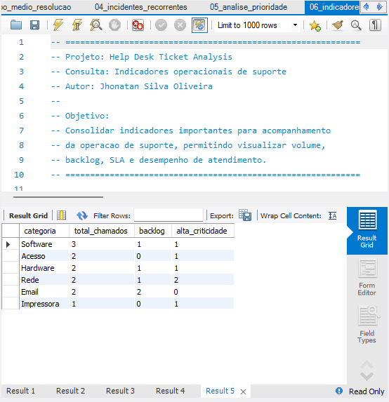

# 📊 Análise dos Resultados — Help Desk Ticket Analysis

## 📌 Visão geral

Este projeto simula a análise operacional de uma central de suporte técnico utilizando SQL.

O objetivo não é apenas consultar registros, mas transformar dados de chamados em informações úteis para acompanhamento da operação, identificação de riscos e apoio à tomada de decisão.

As consultas foram executadas e validadas em ambiente **MySQL**, utilizando o **MySQL Workbench**.

> 📌 Todos os dados utilizados neste projeto são fictícios e foram criados exclusivamente para fins de estudo e demonstração profissional.

---

## 🔎 1. Monitoramento de chamados em aberto

A consulta `01_chamados_abertos.sql` identifica os chamados que ainda necessitam de atuação da equipe de suporte.

A análise considera informações como:

- prioridade;
- status;
- usuário solicitante;
- departamento;
- categoria;
- técnico responsável;
- data de abertura;
- prazo de SLA.

### 📷 Resultado obtido

A execução da consulta retornou **5 chamados ainda pendentes de conclusão**, permitindo visualizar rapidamente quais registros permanecem no backlog da equipe.

### 💡 Análise

O resultado demonstra como uma consulta SQL pode ser utilizada para acompanhar o backlog operacional.

Entre os registros retornados existem chamados com diferentes prioridades e status, permitindo que o analista identifique quais solicitações ainda precisam de acompanhamento e organize a atuação da equipe.

### Aplicação operacional

Essa consulta pode ser utilizada no acompanhamento diário da operação para identificar chamados que ainda aguardam atendimento ou resolução, auxiliando na organização do backlog e na priorização das atividades.

---

## ⏱️ 2. Controle de SLA

A consulta `02_sla_estourado.sql` identifica chamados que ultrapassaram o prazo definido para atendimento.

São consideradas duas situações:

- chamados ainda pendentes cujo prazo de SLA já expirou;
- chamados resolvidos após o prazo estabelecido.

### 📷 Resultado obtido

A execução identificou **6 chamados com SLA ultrapassado**.

### 💡 Análise

A identificação de chamados fora do prazo permite que o analista reconheça rapidamente situações que podem representar impacto na qualidade do atendimento.

A consulta também demonstra que o controle de SLA não deve considerar apenas chamados ainda abertos. Um chamado já resolvido também pode ter descumprido o prazo estabelecido.

### Aplicação operacional

Esse tipo de consulta pode ser utilizado para acompanhar o cumprimento dos níveis de serviço, identificar atrasos e apoiar ações para reduzir reincidências de SLA estourado.

---

## ⏳ 3. Tempo médio de resolução

A consulta `03_tempo_medio_resolucao.sql` calcula o tempo médio necessário para resolução dos chamados agrupados por categoria.

### 📷 Resultado obtido

Os resultados obtidos foram:

| Categoria | Chamados resolvidos | Tempo médio |
|---|---:|---:|
| Software | 2 | 6,38 h |
| Impressora | 1 | 4,92 h |
| Hardware | 1 | 1,75 h |
| Acesso | 2 | 1,42 h |
| Rede | 1 | 1,42 h |

### 💡 Análise

No cenário simulado, a categoria **Software** apresentou o maior tempo médio de resolução, com **6,38 horas**.

A categoria **Impressora** apresentou média de **4,92 horas**, enquanto **Acesso** e **Rede** apresentaram os menores tempos médios entre as categorias analisadas.

Esse indicador permite comparar o esforço necessário para solucionar diferentes tipos de incidentes.

### Aplicação operacional

A análise do tempo médio de resolução pode auxiliar na identificação de categorias que exigem maior esforço técnico, permitindo investigar possíveis gargalos, necessidades de documentação, treinamento ou melhoria de processos.

---

## 🔁 4. Identificação de incidentes recorrentes

A consulta `04_incidentes_recorrentes.sql` analisa a distribuição dos chamados por categoria e a concentração de incidentes de alta criticidade.

### 📷 Resultado obtido

Os resultados demonstraram a seguinte distribuição:

| Categoria | Total de chamados | Alta criticidade | Percentual |
|---|---:|---:|---:|
| Rede | 2 | 2 | 100,00% |
| Software | 3 | 1 | 33,33% |
| Acesso | 2 | 1 | 50,00% |
| Hardware | 2 | 1 | 50,00% |
| Impressora | 1 | 1 | 100,00% |
| Email | 2 | 0 | 0,00% |

### 💡 Análise

A categoria **Software** apresentou o maior volume de chamados, com **3 registros**.

Entretanto, **Rede** e **Impressora** apresentaram **100% dos registros classificados como alta criticidade** dentro de suas respectivas categorias.

Isso demonstra que apenas analisar o volume de chamados não é suficiente. Uma categoria com menor quantidade de ocorrências pode representar maior impacto operacional devido à criticidade dos incidentes.

### Aplicação operacional

Esse tipo de análise pode auxiliar na identificação de problemas recorrentes e categorias que merecem investigação mais aprofundada, permitindo direcionar ações preventivas e buscar soluções definitivas.

---

## 🚨 5. Priorização operacional

A consulta `05_analise_prioridade.sql` identifica chamados ainda pendentes e apresenta informações relevantes para priorização da atuação da equipe.

### 📷 Resultado obtido

A consulta retornou **5 chamados pendentes**, distribuídos entre diferentes níveis de prioridade e status.

### 💡 Análise

Entre os chamados pendentes existem registros classificados com prioridade **Alta**, além de chamados de prioridade **Média**.

A combinação entre prioridade, status, categoria e situação operacional permite ao analista determinar quais incidentes devem receber atenção primeiro.

A priorização adequada evita que chamados de maior impacto permaneçam sem tratamento enquanto solicitações de menor criticidade são atendidas.

### Aplicação operacional

Essa consulta pode apoiar a organização da fila de atendimento, permitindo direcionar os esforços da equipe para os incidentes de maior impacto ou risco operacional.

---

## 📈 6. Indicadores de suporte

A consulta `06_indicadores_suporte.sql` consolida indicadores da operação agrupados por categoria.

### 📷 Resultado obtido

Os resultados apresentados foram:

| Categoria | Total de chamados | Backlog | Alta criticidade |
|---|---:|---:|---:|
| Software | 3 | 1 | 1 |
| Acesso | 2 | 0 | 1 |
| Hardware | 2 | 1 | 1 |
| Rede | 2 | 1 | 2 |
| Email | 2 | 2 | 0 |
| Impressora | 1 | 0 | 1 |

### 💡 Análise

A consolidação dos indicadores permite observar diferentes aspectos da operação em uma única análise.

A categoria **Software** possui o maior volume total de chamados.

A categoria **Email** apresenta **2 chamados no backlog**, enquanto **Rede** concentra **2 chamados de alta criticidade**.

Essas informações demonstram como diferentes indicadores podem revelar situações distintas: volume elevado, acúmulo de chamados ou concentração de incidentes críticos.

### Aplicação operacional

Indicadores consolidados permitem acompanhar o desempenho da operação, identificar áreas que necessitam de atenção e apoiar decisões relacionadas à distribuição de esforço da equipe.

---

# 🧠 Conhecimentos demonstrados

Durante o desenvolvimento e execução deste projeto foram aplicados conceitos de SQL como:

- `SELECT`
- `WHERE`
- `ORDER BY`
- `INNER JOIN`
- `LEFT JOIN`
- `GROUP BY`
- `HAVING`
- `COUNT`
- `AVG`
- `SUM`
- `MIN`
- `MAX`
- `CASE`
- `COALESCE`
- `NULLIF`
- `TIMESTAMPDIFF`
- subqueries
- cálculos percentuais
- manipulação e análise de datas

Além da construção das consultas, o projeto demonstra raciocínio aplicado à rotina de suporte técnico, incluindo:

- análise de incidentes;
- troubleshooting orientado por dados;
- acompanhamento de SLA;
- gestão de backlog;
- análise de prioridades;
- identificação de recorrências;
- acompanhamento de indicadores;
- interpretação de resultados;
- apoio à tomada de decisão;
- melhoria contínua.

---

# 🎯 Conclusão

O projeto demonstra como consultas SQL podem ser utilizadas como ferramenta de apoio ao trabalho de um **Analista de Suporte**.

A partir dos registros de chamados, foi possível transformar dados operacionais em informações úteis para:

- monitoramento do backlog;
- identificação de chamados com SLA ultrapassado;
- análise do tempo médio de resolução;
- identificação de categorias recorrentes;
- avaliação da criticidade dos incidentes;
- priorização das atividades;
- acompanhamento de indicadores operacionais.

Além da construção das consultas, os resultados foram executados e validados utilizando **MySQL e MySQL Workbench**, permitindo demonstrar não apenas conhecimento da sintaxe SQL, mas também capacidade de interpretar os resultados e relacioná-los a situações encontradas em uma operação de suporte técnico.

O cenário apresentado é fictício, porém foi estruturado para representar situações próximas às encontradas em ambientes corporativos de suporte e atendimento de TI.

---

## 📁 Estrutura relacionada

- [`create_database.sql`](../database/create_database.sql) — criação do banco de dados e das tabelas;
- [`sample_data.sql`](../database/sample_data.sql) — dados fictícios utilizados no laboratório;
- [`01_chamados_abertos.sql`](../queries/01_chamados_abertos.sql)
- [`02_sla_estourado.sql`](../queries/02_sla_estourado.sql)
- [`03_tempo_medio_resolucao.sql`](../queries/03_tempo_medio_resolucao.sql)
- [`04_incidentes_recorrentes.sql`](../queries/04_incidentes_recorrentes.sql)
- [`05_analise_prioridade.sql`](../queries/05_analise_prioridade.sql)
- [`06_indicadores_suporte.sql`](../queries/06_indicadores_suporte.sql)

⬅️ [Voltar para o README principal](../README.md)
